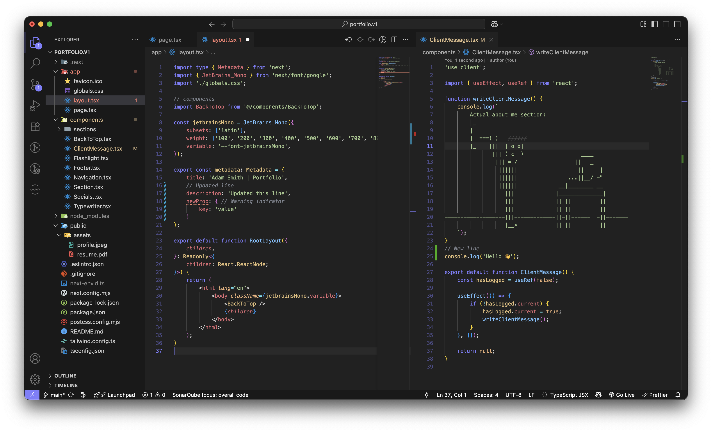

# Void Script — A Dark Minimalist Theme for VS Code

Void Script is a sleek, dark, minimalist theme for Visual Studio Code, designed to reduce eye strain while offering clear syntax highlighting. It features a neutral dark grey background with subtle pops of color, keeping your focus on the code.

🎨 Designed with readability in mind  
🚀 Optimized for JavaScript / TypeScript / JSX / HTML  
💻 Works great for frontend & backend development

---

## Preview



---

## Features

✅ Balanced dark grey background — easy on the eyes  
✅ Distinct color cues for constants, functions, tags, strings, and more  
✅ Minimal use of white — only where it makes sense (text inside elements)  
✅ Subtle UI — lets your code stand out  
✅ Great for long coding sessions

---

## Installation

1. Search for `Void Script` in the [Visual Studio Code Marketplace](https://marketplace.visualstudio.com/vscode)
2. Click **Install**
3. Open Command Palette → `Preferences: Color Theme` → select **Void Script**

---

## Recommended Settings

```json
"workbench.colorTheme": "Void Script",
"window.titleBarStyle": "custom"
```
## Feedback & Support

Found a bug? Have a suggestion to improve Void Script?  
I'd love to hear from you!

You can open an issue or feature request here:  
👉 [GitHub Issues](https://github.com/adamsmithdev/void-script-theme/issues)

Thank you for using Void Script! 🚀
